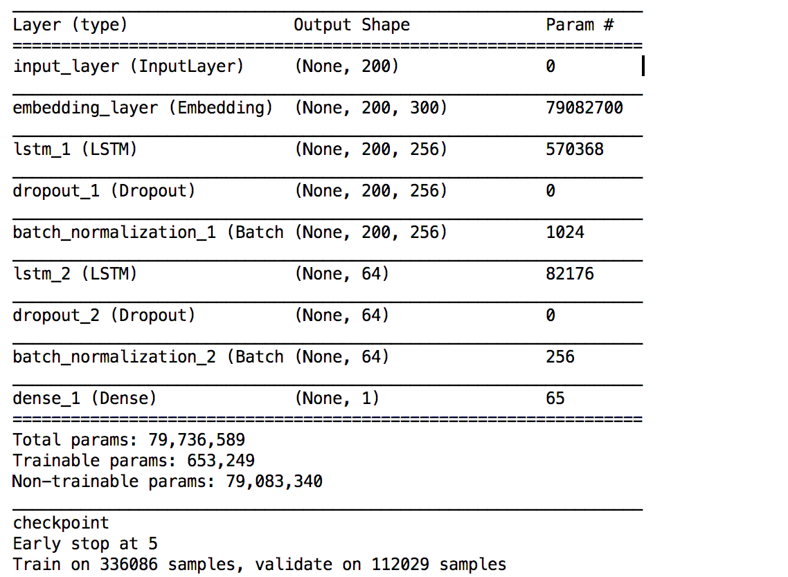
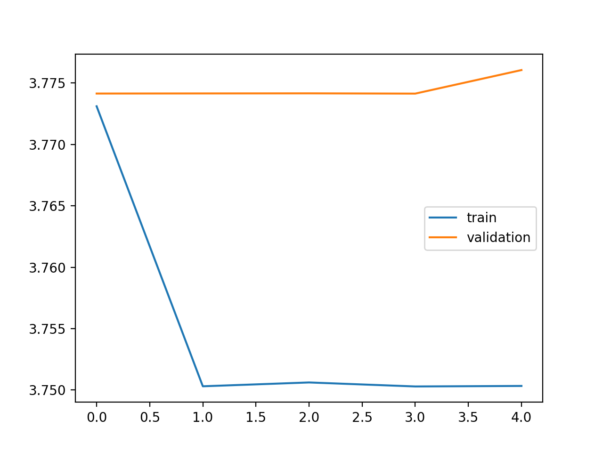

# humorDetectorApp

### Problem statement 

The goal of this data challenge is to create a humor detector which could give a humor score for a specified text input. Here, we define the score in the range of 0-10.  

### Dataset 
Since humor is hard to quatitively describe, in this project, I am trying to evalute yelp review dataset. This dataset consists of about 1.6 million reviews by 366,000 users for 61,000 businesses. Each yelp review has user given votes for three categories - “funny”, “cool” and “useful”. Any review with more than 2 “funny votes” is selected and all the votes were normalized to the range of 0-10 (round to integer). 

The mian reason that I am using this dataset is it offers specific votes, which could be used as the metrics for humor score. Most other public dataset only gives the binary output, wether the text/joke/comment is humorous or not. 

### Model 

To create the word vector, the Glove pretrained word vector was used, then projected as the embedding layer of LSTM model. 

Model architecture:

### Result 

Run for 5 epoch. 

The MSE was used as the evaluation metrics. 
Test MSE: 3.7503
Validation MSE: 3.7761
Test MSE: 1.924

### Deploymennt 

Ongoing 
